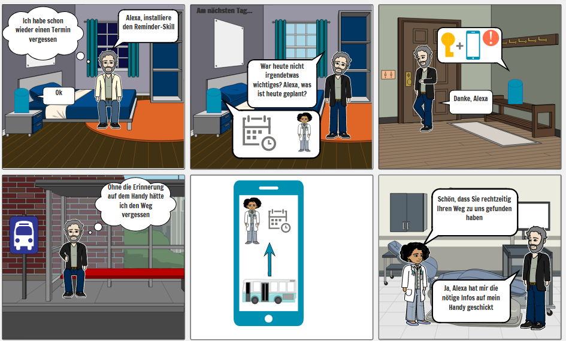

# SWENG1 Team 6 - The Coronials: Termin Helfer


Der Termin Helfer Skill wurde entwickelt, um Personen, welche mit Demenz oder Alzheimer frühdiagnostiziert wurden, dabei zu unterstützen, unabhängig ihren Alltag bestreiten zu können.
Der Kerngedanke hierbei ist die Hilfestellung an jedem Ort. Der Termin Helfer bietet mit seiner Begleit-App zum Skill, auch unterwegs den Überblick zu behalten. Zudem unterstützt Termin Helfer, indem er eine leichte Möglichkeit bietet zum Zielort zu navigieren.

Bitte beachten Sie, dass dies ein Prototyp ist und einige Funktionen noch nicht zu 100% ausgereift sind.



# Nutzung des Skills

Um den TerminHelfer in der Testumgebung anzusprechen, sagen sie:
` "Termin Helfer" `

Darauf sollte der Skill ihnen antworten:
`"Willkommen beim Terminhelfer"`

Mit der Eingabe `"Was kann ich tun?"` sollten ihnen nun einige Optionen genannt werden.

Für weitere Hinweise beachten Sie die Hilfekarte unter [/documents/help-card/](/documents/help-card/Termin%20Helfer%20Hilfe.pdf)

Für häufig gefrage Fragen, beachten Sie das FAQ unter [/documents/faq/](/documents/faq/FAQ.pdf)

# Entwicklungsdokumente

Unter [/documents/](/documents/) finden sich alle Entwicklungsdokumente, wie ein Pressrelease, Aktivitätsdiagram und ein Use-Case-Diagram.


# Allgemeine Vorraussetzungen für die Einrichtung
- Amazon Developer Account mit Zugang zu AWS
- Gülitgen REST-API-Key von [HERE](https://developer.here.com/).
- Uber-Jar: Projekt gebaut mit dem Gradle-Task `uber-jar`
- Node.js
- ASK-CLI (`npm install -g ask-cli`) und Amplify-CLI (`npm i -g @aws-amplify/cli@3.36.2`)

# Einrichtung Skill

## Anlegen eines Alexa Skills
1. Melden Sie sich in der Alexa-Developer-Console mit ihrem Amazon-Developer-Account an
2. Wählen Sie nun `Create Skill`, geben Sie diesem einen Namen und drücken Sie anschließend nochmals auf `Create Skill`. Als Vorlage wählen Sie `Start from Scratch` und anschließend `Continue with template`. Anschließend wird Ihr Skill erstellt (das kann ein paar Minuten dauern)
3. Kopieren Sie unter `Endpoint` Ihre Skill-ID (die brauchen Sie später)
4. Kopieren Sie den Inhalt der Datei `Intents.json` und fügen Sie dies unter `Custom -> Interaction Model -> JSON Editor` ein

## Anlegen des Skill-Lambdas
1. Erstellen einens neuen Lambda in AWS (`Alle Services -> Datenverarbeitung -> Lambda`)
2. Wählen der Option `Ohne Vorgabe Erstellen`, Funktionsnamen angeben und unter `Laufzeit` `Java 11 (Corretto)` wählen
3. Unter `Designer` auf `Auslöser hinzufügen` klicken und im Drop-Down-Menü `Auslöser auswählen -> Alexa Skills kit` wählen
4. Als `Qualifikations-ID` die Skill-ID eingeben, welche aus der Developer-Console kopiert wurde
5. Im Reiter `Laufzeiteinstellungen` als Laufzeit `Java 11 (Coretto)` auswählen und unter `Handler` `thecoronials.handler.TerminHelferStreamHandler::handleRequest` eingeben
6. Unter `Funktionscode` dann die Uber-Jar hochladen
7. Damit die Orts-Suche durchgeführt werden kann, muss der Key für die API von HERE unter Umgebungsvariablen hinterlegt werden. Der Name der Variable ist `here_apikey`
8. Zuletzt mussen der IAM-Rolle des Lambdas noch volle Berechtigungen für StepFunctions und DynamoDB gegeben werden. Dazu die Rolle (hat einen ähnlichen Namen wie das Lambda) in IAM suchen und die Rechte anfügen.

# Einrichtung täglicher Push-Notifications
1. Herunterladen des Skill Manifests mit dem Befehl `ask smapi get-skill-manifest -s skill_id > skill.json` Für "skill_id" muss die Skill Id des zu editierenden Skills eingesetzt werden. Dieser ist in der Alexa Developer Console unter `Your Skills` zu finden.
2. Skill Manifest erweitern mit den am Ende stehenden Einträgen. Beim Speichern darauf achten, dass die Datei UTF-8 codiert ist.
3. Updaten des Manifests mit dem Befehl `ask smapi update-skill-manifest -s skill_id --manifest file:skill.json`
4. Wie bereits beschrieben, eine neue Lambda Funktion erstellen
5. Unter Auslöser `EventBridge (Cloudwatch Events)` hinzufügen
6. Neue Regel mit `Regel -> neue Regel erstellen` erstellen
7. Unter `Ausdruck zeitlich planen` das gewünschte Zeitintervall als Cron-Ausdruck angegeben. Bsp. `00 05 * * ? *` löst jeden Tag um 5 Uhr UTC aus. Eine Ausführliche Anleitung findet sich [hier](https://docs.aws.amazon.com/AmazonCloudWatch/latest/events/ScheduledEvents.html#CronExpressions)

Nicht vergessen, dem installierten Skill in der App unter `Mehr -> Skills und Spiele -> Ihre Skills -> Termin Helfer -> Einstellungen` die Erlaubnis für Benachrichtigungen zu geben.

### Erweiterung des Skillmanifests
```json
"permissions": [
    {
        "name": "alexa::devices:all:notifications:write"
    }
]
```
sowie
```json
"events": {
  "publications": [
    {
      "eventName": "AMAZON.MessageAlert.Activated"
    }
  ],
  "endpoint": {
    "uri": "** TODO: REPLACE WITH YOUR Lambda ARN after created **"
  },
  "subscriptions": [
    {
      "eventName": "SKILL_PROACTIVE_SUBSCRIPTION_CHANGED"
    }
  ]
}
```

# Einrichtung Push-Notifications für Termine

Vor diesem Schritt `Einrichtung täglicher Push-Notifications` beachten.

1. Wie bereits beschrieben, erstellen eines neuen Lambdas mit der Uber-Jar.
2. Setzen des Handlers unter `Laufzeiteinstellungen` auf `thecoronials.notification.handler.NotificationHandler::handleRequest`
3. Hinzufügen von Umgebundvariablen: Bereits vorhandene `proactive_clientid` und `proactive_secretkey` aus der Alexa Developer Console (Reiter Permissions).
4. Unter `Zustandsmaschinen` eine neue Zustandsmaschine anlegen. Die Definition findet sich am Ende des Abschnitts.
5. Kopieren der ARN der Zustandsmaschine und im normalen Lambda für den Skill als Umgebundvariable `proactive_statearn` hinterlegen.

Nun kann der Nutzer Benachrichtigungen erhalten.

### Definition StepFunction
```json
{
  "Comment": "Call a lambda at a given time using wait states",
  "StartAt": "wait_using_timestamp",
  "States": {
    "wait_using_timestamp": {
      "Type": "Wait",
      "TimestampPath": "$.time",
      "Next": "call_lambda"
    },
    "call_lambda": {
      "Type": "Task",
      "Resource": "arn:aws:lambda:eu-central-1:051886484530:function:TerminHelferNotification",
      "End": true
    }
  }
}
```

# Einrichtung Companion App

## Vorbereitung
In den Unterordner `/companion` wechseln

## Amplify CLI
Die leicht alte Version 3.36.2 des CLI-Tools ist hier wichtig, da die aktuelle Version (Stand 29.01.2021) einen Fehler hat, welche es verhindert das Projekt auf einem anderen AWS Account zu erstellen (siehe [Issue](https://github.com/aws-amplify/amplify-adminui/issues/32)).

Wenn das Amplify CLI nocht nicht benutzt wurde, müssen Sie sich erst mit ihrem AWS Account anmelden.
Dazu führen sie `amplify configure` aus. Das Programm wird Sie bitten sich bei AWS anzumelden und anschließend einen neuen IAM Nutzer anzulegen.

## Projekt online nehmen
1. Abhängigkeiten installieren `npm i`
2. Aufrufen von `amplify init`
3. Das CLI führt sie durch den Initialisierungsprozess. Die Frage ob die vorhandene Umgebung genutzt werden soll, muss verneint werden. Wählen Sie anschließend einen Namen für die Umgebung aus.
4. Einrichten der Umgebungsvariablen. Kopieren sie die Datei `src/environments/environment.ts` nach `src/environments/environment.prod.ts` und füllen sie die Variablen aus. `hereKey` ist ein API-Key für die API von [here](https://developer.here.com/), `skillStoreLink` ist der Link zum Skill im Alexa Skill Store (Dieser kann auch ein Platzhalter sein).
5. Aufrufen von `amplify publish`. Dieser Vorgang kann mehrere Minuten dauern. Danach sollte eine URL zum Aufrufen der App erscheinen.
6. Anschließend muss dem Cognito Nutzer noch ein weiteres Attribut hinzugefügt werden. Öffnen Sie dazu die AWS Management Console und öffnen Sie Cognito. Im erstellten User-Pool muss unter `Attribute` ein weiteres Attribut names `linkid` (Typ string, Länge beides 7) hinzugefügt werden.
7. Da die API auf die Datenbank zugreifen muss, muss der IAM-Rolle des erstellen Lambdas noch mindestens Lese-Rechte für DynamoDB gegeben werden. Dieser Schritt ist analog zu dem des Skill-Lambdas. Der Name des Lambdas beginnt mit `TerminHelferAppointment`.

Nun ist die App einsatzbereit.
